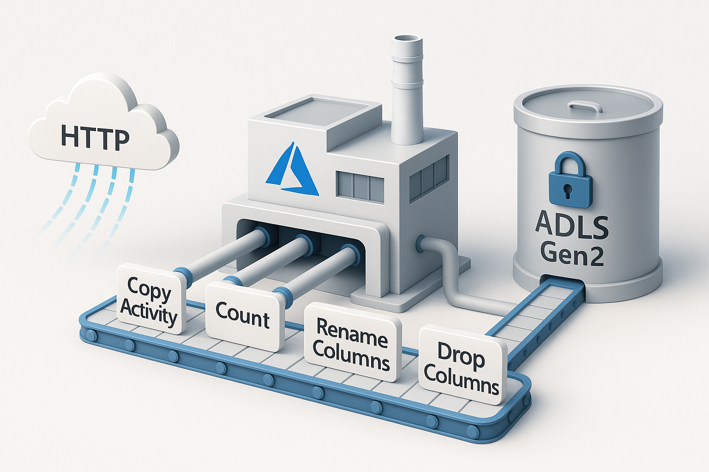

# Azure Data Factory – API to ADLS Pipeline

## 🚀 Objective:
Simulate a pipeline using Azure Data Factory to ingest external API data into ADLS Gen2 and apply basic transformations.

## 🔧 Tools Used:
- Azure Data Factory (ADF)
- ADLS Gen2
- REST API (simulated)
- Copy Activity + Data Flow

## 🛠️ Process:
- Connect external data source (HTTP)
- Use Copy Activity to ingest data
- Apply transformations:
  - Drop columns
  - Rename columns
  - Row count
- Store final output in ADLS Gen2

## ✅ Outcome:
Designed a production-style ETL flow using low-code cloud services.

## 📸 Pipeline Architecture

