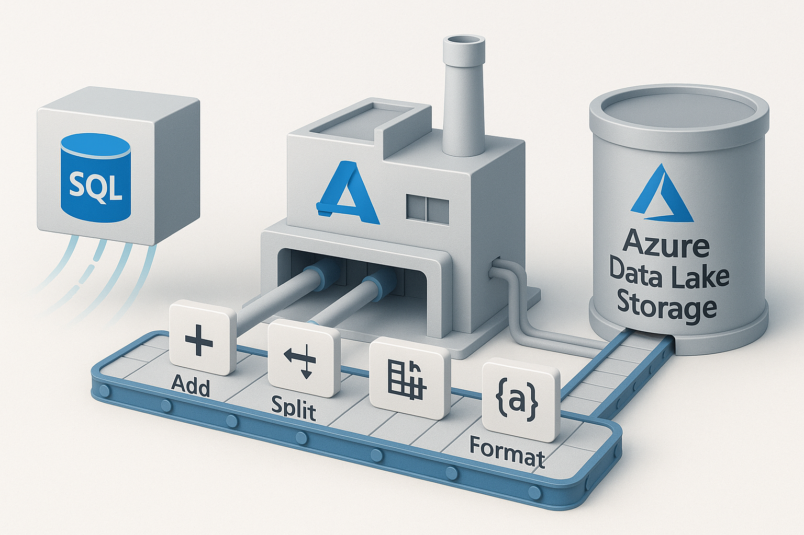

# Azure Data Factory – Azure SQL to ADLS ETL Pipeline

## 🚀 Objective:
Create an end-to-end ETL pipeline that extracts data from Azure SQL Database and loads it into ADLS Gen2 using Azure Data Factory.

## 🔧 Tools Used:
- Azure Data Factory (ADF)
- Azure SQL Database
- ADLS Gen2
- Copy Activity
- Aggregation & Rename (via Data Flow or within ADF)

## 🛠️ Process:
- Connect Azure SQL as source
- Use Copy Activity to extract tables
- Rename & aggregate columns (inside ADF)
- Load final result into ADLS Gen2 container

## ✅ Outcome:
Cloud-native ETL process that can scale to real-world structured data migrations.

## 📸 Architecture Diagram:

